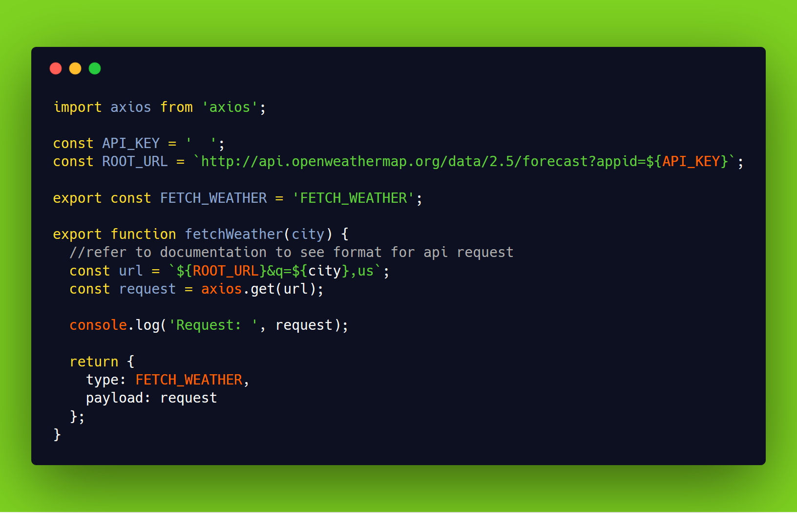
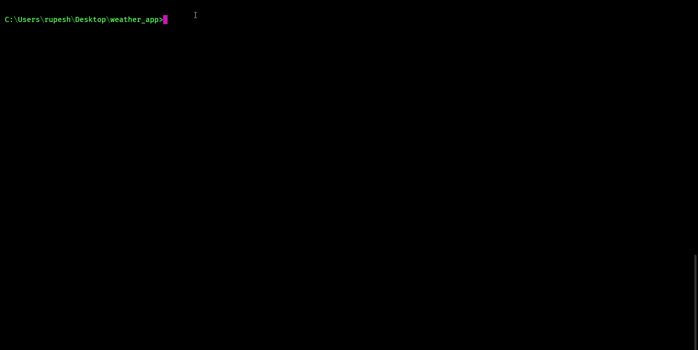

# Weather app

  

## How To Use

To clone and run this application, you'll need [Git](https://git-scm.com) and [Node.js](https://nodejs.org/en/download/) (which comes with [npm](http://npmjs.com)) installed on your computer. From your command line:

```bash
# Clone this repository
$ git clone https://github.com/rupesh1310/weather_app.git

# Go into the repository
$ cd filename 

# Install dependencies
$ npm install

# Run the app
$ npm start
```
```bash
# Add your api key in ./src/actions/index.js 
const API_KEY = ' ';
```




